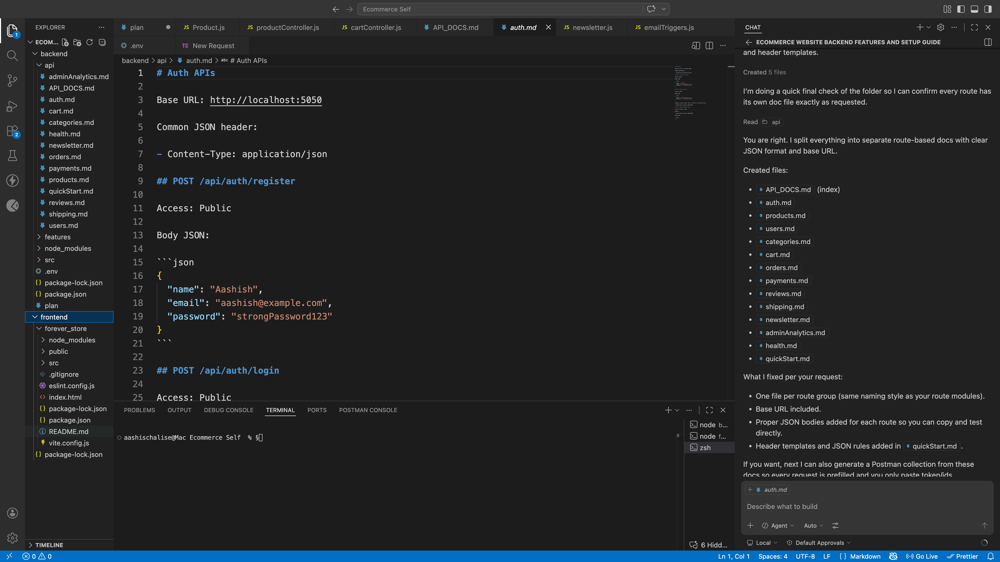

# Auth APIs

Base URL: http://localhost:5050

Common JSON header:

- Content-Type: application/json

## POST /api/auth/register

Access: Public

Body JSON:

```json
{
  "name": "Aashish",
  "email": "aashish@example.com",
  "password": "strongPassword123"
}
```

## POST /api/auth/login

Access: Public

Body JSON:

```json
{
  "email": "aashish@example.com",
  "password": "strongPassword123"
}
```

Response contains token. Use it like this on private routes:

- Authorization: Bearer YOUR_TOKEN

## POST /api/auth/admin-login

Access: Private + Admin

Headers:

- Authorization: Bearer YOUR_TOKEN

Body JSON:

```json
{}
```
